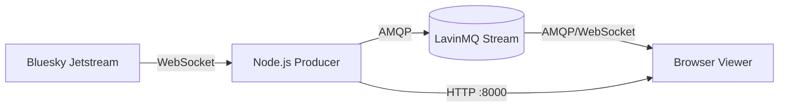

# Bluesky Streams

A live, hands-on demo of **LavinMQ stream filtering**, powered by the public [Bluesky Jetstream](https://github.com/bluesky-social/jetstream) firehose.

The producer subscribes to the Jetstream WebSocket and re-publishes every commit (~250 msg/s) to a LavinMQ stream queue, tagging each message with AMQP headers (`bs.type`, `bs.lang`, `bs.has_media`, `bs.date`). The browser viewer connects directly to LavinMQ over AMQP-over-WebSocket and uses `x-stream-filter` to receive only the messages whose headers match — for example, English-language posts with embedded media. You get a continuous real-world stream to experiment with; no synthetic traffic to generate.

## LavinMQ features this demo exercises

### Stream queues (`x-queue-type: stream`)
The queue is declared as a stream — an append-only, durable log every consumer reads independently. Streams are what enable both replay and broker-side filtering. _See `index.js` `connectAMQP()`._

### Stream filtering (`x-stream-filter`)
The viewer subscribes with arguments like `{ "x-stream-filter": { "bs.lang": "en", "bs.type": "post" } }`. LavinMQ matches each message's headers against the filter and only delivers matches — at ~250 msg/s of mixed traffic, a `bs.lang=en` + `bs.type=post` filter typically delivers a fraction of the messages, all bandwidth saved at the broker. _See the `subscribe()` call in `index.html` (consumer side) and `extractHeaders()` in `index.js` (producer side)._

### Stream offsets (`x-stream-offset`)
The viewer's "Start Position" picker chooses between `last` (tail) and `first` (replay from offset 0). Streams retain history independently of consumer state, so a fresh consumer can read the entire backlog or just live messages — the broker tracks each consumer's offset. _See `consumeOptions.args` in `index.html`._

### Policies (`lavinmqctl set_policy`)
A one-shot `policy-init` container in `docker-compose.yml` runs `lavinmqctl set_policy bluesky-retention "^bluesky-stream$" '{"max-length-bytes":500000000}' --apply-to=queues` before the producer starts. Retention is enforced broker-side (older segments dropped once the stream exceeds 500 MB) — you can change it without touching the producer or the queue declaration. _See `docker-compose.yml`._

### AMQP-over-WebSocket
The browser viewer speaks AMQP directly to LavinMQ on port 15672. There's no application server in the message path — the producer's HTTP server only serves static files. _See `AMQPWebSocketClient` usage in `index.html`._

### Management UI
The viewer's header has a live "Open queue in LavinMQ →" link that points at the queue page in LavinMQ's management UI (login `guest`/`guest`). Watch publish vs. deliver rates, consumer counts, and segment retention while you toggle filters in the viewer.

## Quick start

```bash
docker compose up
```

Then open <http://localhost:8000>, optionally pick a filter, and click **Start Stream**. The compose stack brings up LavinMQ, applies the retention policy, and starts the producer (which ingests Jetstream and serves the viewer).

## Architecture



## Headers attached by the producer

| Header         | Example       | Notes                                            |
|----------------|---------------|--------------------------------------------------|
| `bs.type`      | `post`        | Activity kind: post / like / repost / follow / … |
| `bs.lang`      | `en`          | First language tag of a post                     |
| `bs.has_media` | `true`        | Set when the post has an embed                   |
| `bs.date`      | `2026-05-05`  | UTC date of the event                            |

These are the four headers the viewer filters on. Anything else can be added in `extractHeaders()`.

## Running without Docker

```bash
npm install
AMQP_URL=amqp://localhost:5672 npm start
```

Requires LavinMQ already running locally with AMQP on 5672 and AMQP-over-WebSocket on 15672. Apply the retention policy yourself if you want it:

```bash
lavinmqctl set_policy bluesky-retention "^bluesky-stream$" \
  '{"max-length-bytes":500000000}' --apply-to=queues
```

## Configuration

| Variable      | Default                  | Purpose                      |
|---------------|--------------------------|------------------------------|
| `AMQP_URL`    | `amqp://localhost:5672`  | Producer's broker connection |
| `STREAM_NAME` | `bluesky-stream`         | Stream queue name            |
| `HTTP_PORT`   | `8000`                   | Viewer HTTP port             |

## Links

- [LavinMQ streams documentation](https://lavinmq.com/documentation/streams)
- [Bluesky Jetstream documentation](https://github.com/bluesky-social/jetstream)
