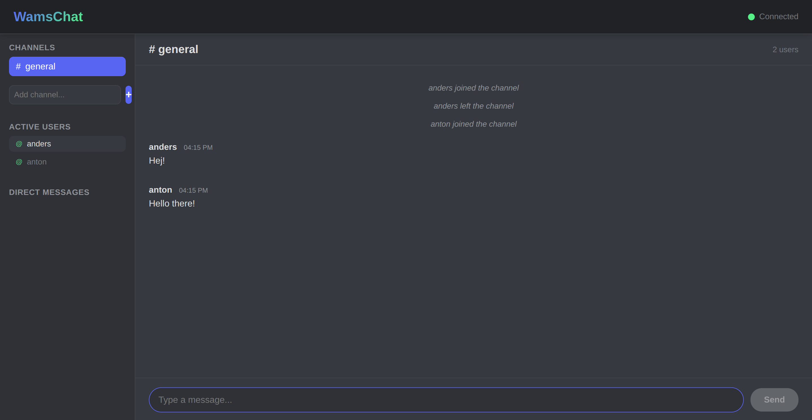

# WamsChat

A client-side chat application using AMQP streams over WebSockets.



## Features

- 🚀 **Zero Backend**: Pure client-side application using AMQP streams
- 🔐 **OAuth2 Authentication**: Sign in with GitHub (or any OAuth provider)
- 💬 **Real-time Chat**: Instant messaging across multiple channels
- 📱 **Direct Messages**: Private messaging between users
- 🌊 **AMQP Streams**: Message persistence with LavinMQ

## Prerequisites

- **LavinMQ** running on `localhost:15692` (WebSocket port)
- **Node.js** 18+ for development

## Getting Started

```bash
# Install and run
npm install
npm run dev
```

Open <http://localhost:3001> to start chatting.

## OAuth2 Setup (Optional)

Want to use "Sign in with GitHub" instead of hardcoded credentials?

See [OAUTH_SETUP.md](OAUTH_SETUP.md) for complete setup instructions.

Quick summary:
1. Register GitHub OAuth App
2. Configure LavinMQ with OAuth2 userinfo endpoint
3. Set `VITE_OAUTH_CLIENT_ID` in `.env`
4. Done! LavinMQ validates tokens, no extra backend needed.

## How It Works

The app connects directly to LavinMQ via WebSocket using `amqp-client.js`. Each chat channel is an AMQP stream, providing real-time messaging with built-in persistence.
